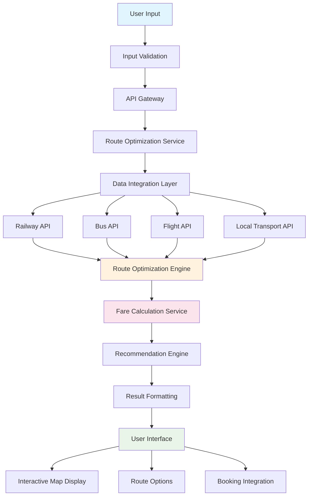

# Velora System Flowchart

## Flow Explanation:

1. **User Input**: Traveler enters origin, destination, date, preferences
2. **Input Validation**: Check data format and completeness
3. **API Gateway**: Authentication and request routing
4. **Route Optimization Service**: Main processing coordinator
5. **Data Integration Layer**: Fetch data from multiple transport APIs
6. **Route Optimization Engine**: Calculate optimal multi-modal routes
7. **Fare Calculation Service**: Compute costs for each route option
8. **Recommendation Engine**: Personalize suggestions based on user preferences
9. **Result Formatting**: Structure data for frontend display
10. **User Interface**: Display results with interactive maps and options

## Key Components:

### Backend Services:
- Route optimization algorithms
- Real-time data processing
- Multi-modal fare calculation
- Personalized recommendations

### Frontend Features:
- Interactive map visualization
- Real-time updates
- Comprehensive route information
- Booking integration

### Data Sources:
- Indian Railways API
- State transport corporations
- Private bus operators
- Airline systems
- Local transport services
